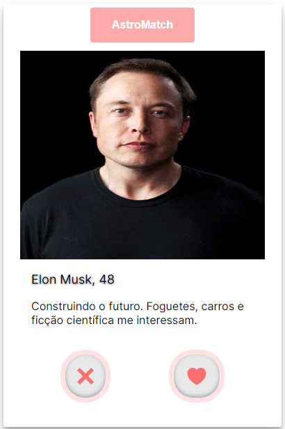
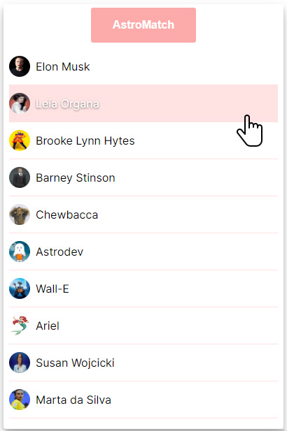
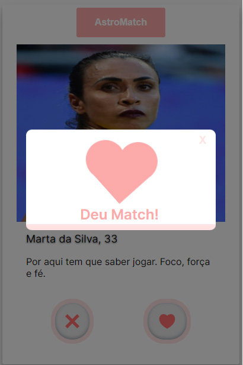
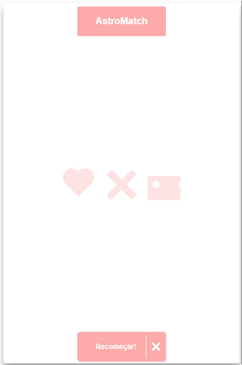

# `AstroMatch`

Projeto Frontend desenvolvido em NextJS

# `Link`

https://marleo-astromatch.vercel.app

# `Descrição`

## Este projeto consiste em duas telas:

| Tela de Likes | Tela de Matches |
| :------------: | :------------: |
|  |  |

Quando acontece um "Match", uma modal indicando isso surge na tela:
| Modal de Match |
| :------------: |
| |

Quando a API está carregando um novo perfil e/ou terminaram os perfis, esta tela com um loader e um botão para reiniciar o jogo aparece:
| Loader & Reset |
| :------------: |
| |

O repositório do projeto pode ser encontrado [aqui](https://github.com/marleopr/astromatch-next)
A documentação da API do projeto pode ser encontrado [aqui](https://documenter.getpostman.com/view/7549981/SW12yx56?version=latest)

# `Instalando e rodando o projeto`

Pré-requisitos: Certifique-se de ter o Node.js instalado no seu computador.

- Clone o repositório: Clone o repositório do projeto a partir do GitHub usando o comando git clone https://github.com/marleopr/astromatch-next.git.

- Instale as dependências: Navegue até o diretório raiz do projeto e execute o comando npm install para instalar todas as dependências listadas no arquivo package.json.

- Inicie o servidor de desenvolvimento: Após a conclusão da instalação das dependências, execute o comando npm run dev para iniciar o servidor de desenvolvimento.

- Acesse o site: Abra o navegador e acesse http://localhost:3000 para visualizar o projeto AstroMatch.

# `Tecnologias utilizadas`

NextJS

# `Autor`

[Márleo Piber da Rosa.](https://marleo-portfolio.vercel.app/)
